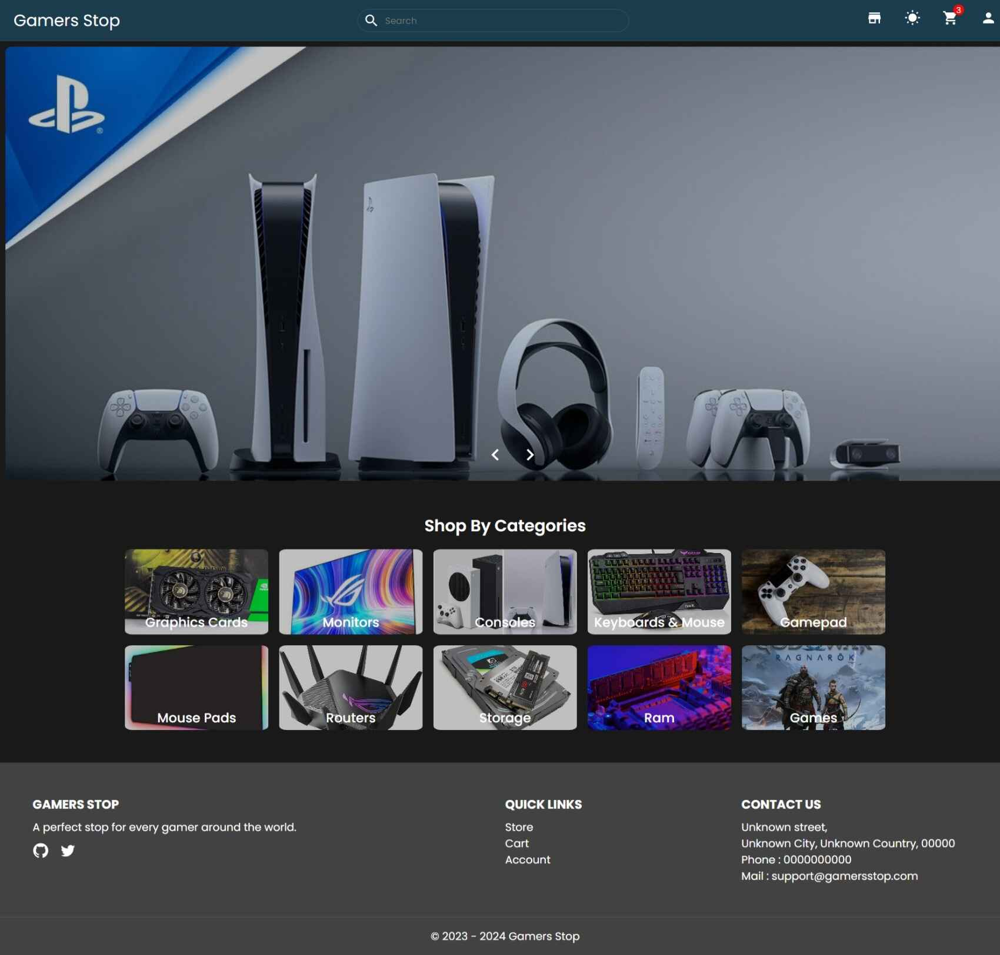
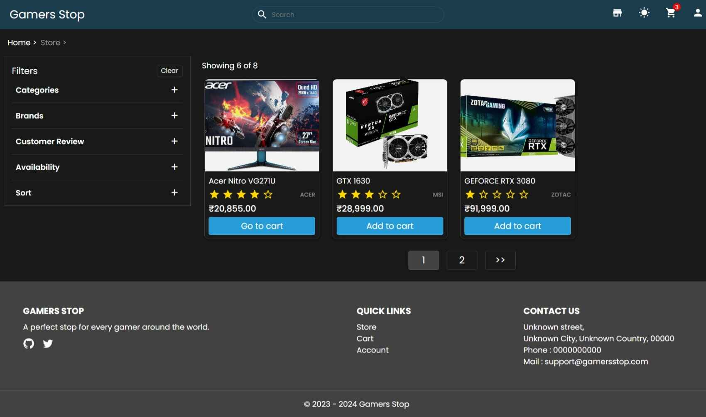
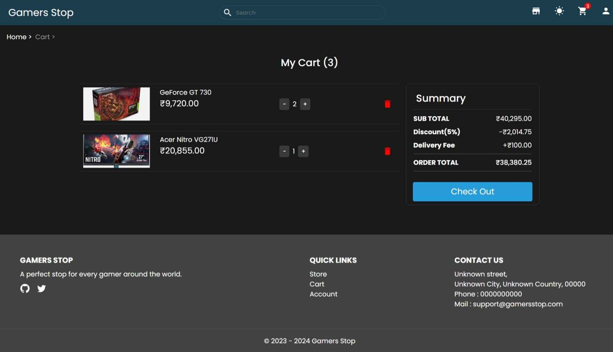
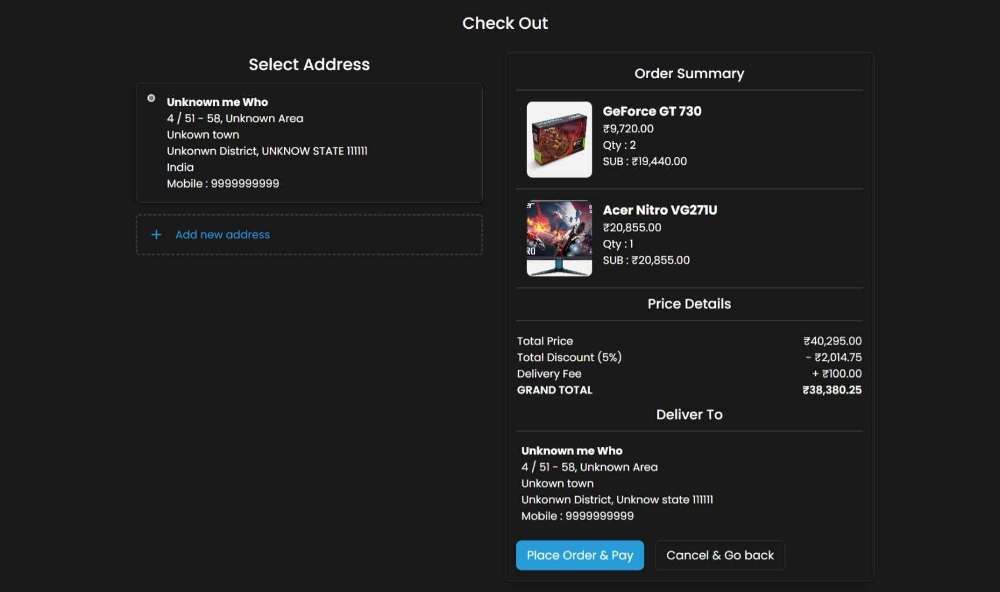
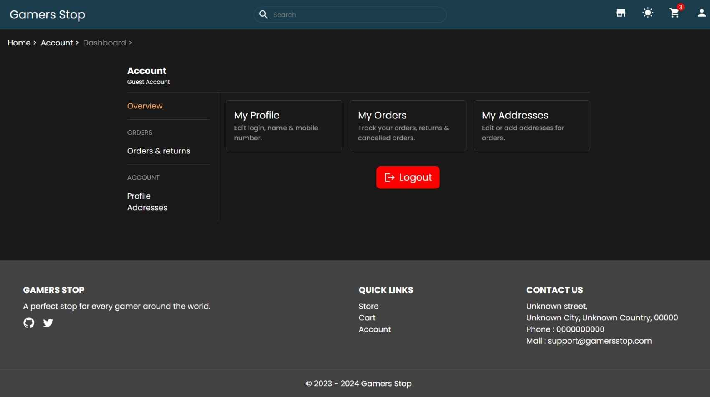

# Gamers Stop

Welcome to our Gamers Stop Ecommerce Web App! This project is built using React.

## Screenshots

  
  
  
  


## Built with

1. [React](https://react.dev/)
2. [Typescript](https://www.typescriptlang.org/)
3. [react-router-dom](https://reactrouter.com/en/main) (For routing)
4. [Firebase](https://firebase.google.com/) (For data storage)
5. [Material Ui Icons](https://mui.com/material-ui/material-icons/)
6. [Redux Toolkit](https://redux-toolkit.js.org/)
7. [react-hook-form](https://react-hook-form.com/)

## Links

- Live Site URL : [Click here](https://gamers-stop-ecommerce.vercel.app/)

## Steps for installation

- Open your faviorite terminal as paste the below commands.

```sh

git clone https://github.com/apr61/gamers-stop-ecommerce

cd gamers-stop-ecommerce

npm install

```

- Update the `.env` with your project details of __Firebase__.

```ts
VITE_APP_FIREBASE_API_KEY = ""
VITE_APP_FIREBASE_AUTH_DOMAIN = ""
VITE_APP_FIREBASE_PROJECT_ID = ""
VITE_APP_FIREBASE_STORAGE_BUCKET = ""
VITE_APP_FIREBASE_MESSAGE_ID = ""
VITE_APP_FIREBASE_APP_ID = ""
VITE_APP_FIREBASE_MEASUREMENT_ID = ""
VITE_APP_RAZORPAY_KEY_ID = ""
VITE_APP_RAZORPAY_KEY_SECRET = ""
```

- Run the project

``` sh
npm run dev
```

Happy Hacking 😉
